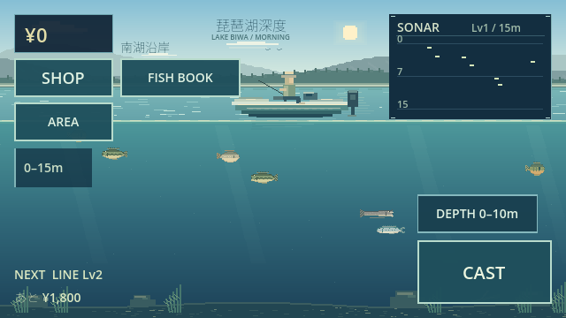
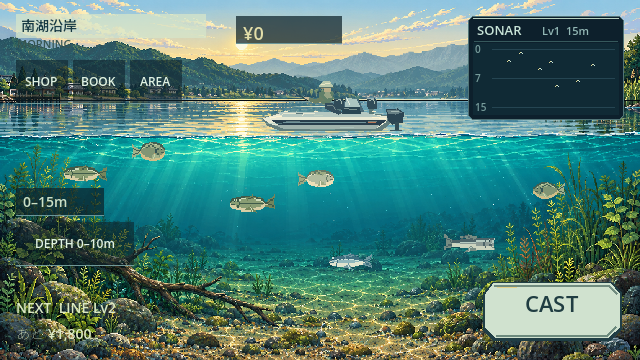

# Golden Screen 01 — 南湖沿岸・朝

Base: `82c94725e08d415c849b90e17a69f34420bd905c` / Godot 4.6.3. Work is confined to `feature/visual-overhaul-v2`; no public deployment or protected branch update.

## Before / After

Before: repetitive procedural ridges, sparse bed detail, rectangular boat silhouette and equally weighted blue HUD panels. After: original high-density raster cutaway, irregular atmospheric ridges/inhabited shore, broken morning reflection, transparent teal depth, directional light, edge foliage/gravel/driftwood and a clear central fishing lane. Boat/angler and five fish species receive distinct shading and silhouettes. Three-frame tail animation preserves AI and collision envelopes.

## Art direction / palette

Beautiful, quiet freshwater morning; no additional horror. Pale cyan/cream sky, blue-grey distant mountains, green-grey shore, cyan-to-teal underwater, navy instruments, sage primary button and restrained gold accents. Reference colors: sky #9CC8D2/#B7D6D4/#F0E0B0, shore #3F665B, water #3C8B91/#2E7079/#24545F, HUD #0D202C/#122E3A, highlight #C8E4D8, gold #E6D28B. Existing anomaly color/conditions remain unchanged.

Waterline follows the existing 136/360 split. Seven Sprite2D atlas bands share the original 1672×941 illustration; the three painted mountain planes are not independent alpha-separated parallax layers. Sparse low-rate texture accents provide moving waterline, glitter, boat reflection/wake and suspended motes. No shader, blur, dynamic light or particle system was added.

## Assets / scope

Assets: `assets/visual/golden/south_shore/{sky,mountains,shore,water,lakebed,boat,fish,hud}`. Offline generator: `tools/generate-golden-sprites.py`; PNGs and SpriteFrames are checked in. Runtime integration: `scripts/visual/golden/`. Original background/boat/fish/HUD is restored outside south_shore morning, shallow band, and on story/ending/hidden/travel screens. SHOP/BOOK/Opening/Endings were not reskinned.

Money and area/time become compact instruments. SHOP/BOOK/AREA are secondary; SAVE remains in the existing AREA modal. CAST/HOOK/REEL share one bottom-right 144×64 footprint with state visibility controlled by the existing fishing controller. All interactive targets retain at least 44 physical pixels, including the small-scale test. Noninteractive money/depth badges use 28px height. Existing safe-area margins are respected; title text is not painted during normal golden gameplay. No gameplay, price, spawning, fight, story or save-schema change.

## Screenshots

- [Ready 16:9 / 640×360](golden-south-shore/01_ready_16x9.png)
- [Ready 19.5:9](golden-south-shore/02_ready_19_5x9.png)
- [Ready 20:9](golden-south-shore/03_ready_20x9.png)
- [CAST](golden-south-shore/04_cast.png)
- [HOOK](golden-south-shore/05_hook.png)
- [REEL](golden-south-shore/06_reel.png)
- [Sonar after catch](golden-south-shore/07_sonar.png)

These are actual Web renderer captures, not mockups. Isolated browser saves were used. No production user save was deleted.

## Verification

Golden dedicated acceptance: 88 checks PASS. Existing regression runner: 31 cases PASS (Phase1–5, MVP, visual, mid/late, bosses, full-game routes, save/restart and 100-cycle stress). Additional narrative/aim/boss-web/telemetry/restart cases: 8 PASS. Opening: 84 checks PASS. Import, headless launch, Web release export: PASS. Critical errors: 0 in recorded runs.

Web touch smoke: real CAST→HOOK→REEL→CATCH→sale; SHOP/BOOK/AREA open/close, AREA manual save to IndexedDB, reload money restoration. 16:9, 19.5:9, 20:9 / 640×360 layout PASS. Native test verifies scope restoration, unchanged save/AI/hit geometry, 44px touch targets and stable node count across 100 visual scope toggles. Detailed machine results: `verification-results.json`.

Legacy acceptance expectations for compact, noninteractive information badges and new fish texture cache were updated; actual operation-button and safe-area assertions remain enforced. Pacing simulation still reports the pre-existing pacing target unmet; balance was deliberately not changed in this visual task.

## Performance notes

Local Chromium software-rendered comparison against an exact-base archive: cold start before 4.80s / after 3.44s; median requestAnimationFrame interval before 66.6ms / after 16.7ms, p95 before 83.4ms / after 33.4ms. These short local measurements are browser scheduling samples, not physical-phone GPU FPS or proof of universal improvement. No clear regression was observed in this environment.

PCK grows from 9,347,208 to 11,703,464 bytes (+2,356,256). The original background texture is roughly 6MiB decoded RGBA, shared by seven atlas sprites. Added nodes: 11 (coordinator, backdrop, seven sprites, water accent renderer, time label); no per-frame node creation or file IO. Accent redraw is capped at 20Hz with a small fixed number of texture draws. Actual mobile memory, GPU draw calls and cold loading over cellular remain device QA items.

## Manual art gate

Overall Visual Quality, Lake Beauty, Boat Quality, Fish Quality, Water Quality, HUD Quality, Sonar Quality, Commercial Game Feel: **MANUAL REVIEW REQUIRED**. Automated tests establish loading/layout/functionality only. Do not expand to other areas/night/deep, reskin modals, or deploy until the user reviews and approves this direction.
