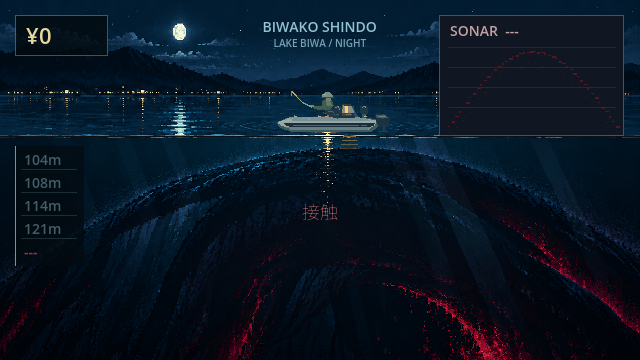

# No.00「帰ってきたもの」— reference visual v2

Branch: `feature/hidden-visual-v2`. Base: `38ec45b3accc6ad5db005beca9cefba9baf55873`. The user supplied a night lake / small illuminated boat / immense curved mass reference during work; this final version follows that direction.

Only the No.00 encounter presentation changes. Moonlit lake, distant shoreline lights, calm reflections, a warm lantern and a vast open surface fragment replace primitive shadow bars. Neither a complete creature nor its identity is shown. Burgundy accents remain local to the hidden encounter; no event, explanation, face, eyes, teeth or tentacles were added. Normal night/other areas/No.15/Golden Screen are not reskinned.

## Actual game view

[Fight 16:9 / 640×360](no00/02_fight_16x9.png) · [19.5:9](no00/03_fight_19_5x9.png) · [20:9](no00/04_fight_20x9.png) · [REEL](no00/05_reel_held.png) · [Final choice](no00/06_final_choice.png)

Screenshots are actual exported Web rendering, from a local debug-only fixture with its own `user://tests/` Save. They are not composited mocks or proof of a manual full playthrough. This capture fixture is excluded from the production export and is never a production menu or public URL.

## Scope and implementation

Runtime change is confined to `scripts/ui/hidden_visual.gd`. The background has no baked HUD/boat/fish; the boat follows the existing position, pull and rod-tip/line, with a presentation-only 0.8 visual scale. Original No.00 state drives all fades and motion. Compact money/night/depth instruments display existing data; original 104→108→114→121→--- readings and timings are preserved. The current depth label is visually replaced while active and its modulation restored afterward. Contact text receives a small burgundy style and moves into the underwater area; its original style is restored on other stages. Sonar fragments still use the existing response/warning/old-contact inputs.

No edits to fishing controllers, HiddenRoute/HiddenFight, fish profiles, balancing, prices, progression, Save, story or endings. The 50-second fight, both final choices, count=2 and no full-body catch remain unchanged. No new runtime nodes or File IO. Existing title shadow / fade-out is retained.

## Assets and performance

Source/reference provenance: `assets/visual/hidden/no00/README.md`. Offline helper fits the original waterline into 640×360 without shifting game geometry. Runtime texture is approximately 900KiB decoded RGBA; the high-resolution source is excluded. Two raster bands and a bounded number of small instrument/boat drawing commands; no fullscreen shader, bloom, blur, dynamic light or particles.

Production Web PCK: 12,081,264 bytes versus base No.15 visual 11,815,148 bytes (+266,116 bytes, roughly 260KiB). Physical smartphone GPU performance and subjective horror feel are unmeasured.

## Acceptance

No.00 visual acceptance: 9 checks PASS, including opaque/nonempty raster pixels, no body node, unchanged redraw Save/node count, real contact/fight/choice, immutable count=2 and exclusion from the fish catalog. Existing regression: 31 cases PASS, including both hidden endings, normal boss, full-game routes, 100-cycle stress and Save restarts. Additional Golden Screen 88 / No.15 visual 20 / narrative 50 checks PASS. Import, headless, production release Web export and isolated debug Web capture PASS. Recorded critical errors: 0.

Debug Web fixture confirms REEL hold/release and three aspect ratios, with no ordinary user Save access. Detailed results: `no00/verification-results.json`.

To reproduce local screenshots: `python tools/build-hidden-visual-qa.py`; serve `/tmp/no00-visual-qa-project/build/qa` on 127.0.0.1:8767; run `python tests/web/hidden_visual.py`. Production `project.godot` and export preset remain untouched.

**Visual direction, ominous scale, horror feel and physical phone appearance: MANUAL REVIEW REQUIRED.** No public deployment was performed. Protected branches and previous visual branches remain unchanged.
