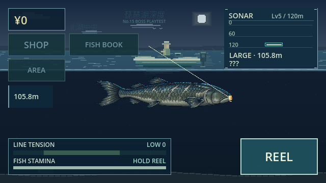

# No.15 湖底の主 — Visual v2

Branch: `feature/boss-visual-v2`. Base: `0a3cf79bfaa8d1fdd288e66a39e5ee8f0bf88732` (approved Golden Screen branch). No public Web deployment, no update to the Golden Screen branch or protected release/main branches.

Only the main-game final boss **No.15 湖底の主** is visually replaced. The hidden boss No.00, all other fish, abyss environment/HUD, endings and normal Golden Screen remain unchanged.

Before: simple filled silhouette, small marks and rectangular fins. After: original three-frame pixel raster, a broad blunt head/gill plate, layered old scales, thick swept fins and a heavy forked tail. Slate teal, subdued olive and old ivory provide a naturally dark but readable body; healed pale scars suggest age. No new horror effects or glow/red eye/teeth/face/tentacles.

## Implementation

`BossPixelArt.texture()` now returns preloaded AtlasTexture resources. All gameplay/fish data files are byte-identical to base. 288×96 frame envelopes, three frames, four fps, mouth/line anchor, AI, collisions, facing, scaling, BITE, SURGE/DIVE, fight balance, size/price, reward, Save schema and endings remain unchanged. Atlas frames share one 288×288 PNG (roughly 324KiB decoded RGBA); there are no added runtime nodes, shaders or per-frame allocations. The high-resolution source is preserved for later artist replacement; only the small shared atlas is referenced during rendering. The source folder uses `.gdignore` to exclude the high-resolution sheet from Web imports/exports.

Web PCK: 11,815,148 bytes versus base Golden Screen 11,703,464 bytes (+111,684 bytes). High-resolution source is excluded; runtime atlas adds no nodes. Physical mobile performance remains unmeasured.

## Screenshots

Actual isolated Web boss fixture (`?boss_test=15`), not gameplay progression proof. Ordinary user saves were not accessed.

[HOOK](no15/02_hook_16x9.png) · [19.5:9](no15/04_fight_19_5x9.png) · [20:9](no15/05_fight_20x9.png) · [REEL held](no15/06_reel_held.png)

## Verification

No.15 visual acceptance: 20 checks PASS, including transparent margins, 288×96 geometry, original animation timing, mouth alignment, shared cache, unchanged Save snapshot and real boss hook/fight/landing.

Golden Screen regression: 88 checks PASS; narrative regression: 50 checks PASS.

Existing regression: 31 cases PASS, including Phase1–5, MVP, visual, mid/late, boss and hidden, full-game ending variants, 100 fishing cycles and Save restarts. Import, headless and Web release export PASS; recorded critical errors 0. Web touch CAST/HOOK/REEL and 16:9 / 640×360, 19.5:9, 20:9 screenshots PASS. Detailed results: `no15/verification-results.json`.

**Boss visual quality / presence / physical smartphone appearance: MANUAL REVIEW REQUIRED.** No game difficulty or timing changes were made. This branch is prepared for review only; public Web playtest remains unchanged.
