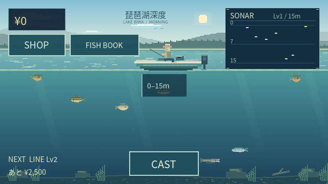
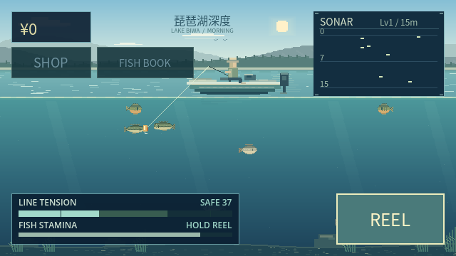
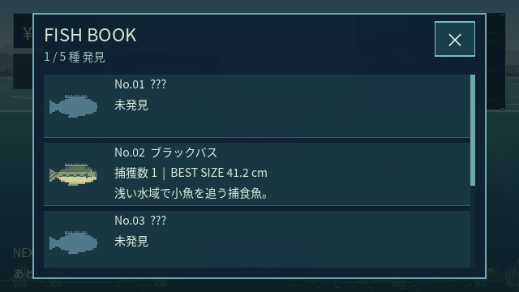

# Visual Refinement Phase 1

確認日: **2026-10-05**。Godot **4.6.3.stable.official.7d41c59c4**。
Repository: `hidetora1986/biwako-shindo`。
Branch: `feature/visual-refinement-v1`。
Base: `feature/mvp-fishing` / `2d3f4f36d6c8ae6c3a566a3d580f178bc57bb708`。

mainとfeature/mvp-fishingは変更・Mergeしない。

## 表示の変更

- 朝昼の青い空と水平線の淡い光、3種の雲形、薄い日差し。遠景は独立したFarMountains・MiddleMountains・NearShoreで、遠いほど明るく低コントラストにする。
- 湖面は穏やかな横揺れ、淡い横の反射、細いハイライト。ボート直下の短い航跡・分断した反射と空の明るい部分の反射を加える。既存の上下揺れを維持する。
- 水中は明るい青緑→青→濃い青。控えめな光の帯、砂泥、小石、岩、水草、1本の普通の沈木。中央の釣り領域を空け、通常の浅場として描く。
- ボートは元の110px幅に対して154px（1.4倍）。船体・デッキ・シート・船外機・釣り人・竿が読める自作素材にする。ゲーム上の船の位置・竿先・ライン接続座標は変えない。
- 既存5種の魚を自作3フレームのピクセル素材にする。ブルーギルは体高と縞、バスは側線と大きな口、フナは丸い銀黄の体、ナマズは長く低い体とひげ、ビワマスは細身・斑点・二股の尾。
- 個体ごとの表示倍率は既存seedと確定済みサイズから計算する。魚Spriteだけを0.7〜1.0倍の範囲で変え、元の40×22フレームとAI境界を超えない。ゲームの乱数・サイズ値・速度・位置は変えない。
- HUDは暗い半透明の濃紺、淡水色の角のある境界、明るい文字で統一。CASTは明るい主操作、Disabledは暗く、REEL押下時は明るくなる。既存のタッチ領域・Safe Areaを維持する。
- Tensionは安全域の緑青→黄色→淡い黄の危険域。危険端をクロスハッチで示し、強い赤を使わない。既存のSAFE／HIGH／BREAK RISK、RUN予兆、Stamina表示の判定は変えない。
- Sonarは濃紺の背景・深度線・明るい魚影・小さな角のフレームで整理。情報レベル・同期・探知範囲・0.6秒の異常反応とその発生条件を維持する。
- 図鑑に魚のカードを加える。未発見は共通の匿名シルエットと???、発見済みは実魚の絵と既存の名前・捕獲数・BEST・説明。ショップは4カテゴリの効果欄と購入欄を濃淡で分ける。

## ロジックを保つ構造

新規`RefinedPixelArt`は素材の生成とキャッシュ、`fish_visual.gd`はAnimatedSprite2Dだけの表示、`pixel_ui_visual.gd`はThemeと図鑑カードを扱う。図鑑の既存Labelと辞書・シグナル・入力処理は保持し、画面の装飾だけを加える。

以下はBaseから変更なし:

- `scripts/fishing/`全体（CAST・BITE・HOOK・Fight・Lure・Anomaly）
- `scripts/fish/fish_controller.gd`、`fish_fight_profile.gd`
- `scripts/economy/`、`scripts/save/`、魚・装備のResourceデータ
- HUDレイアウト、Shop・Fish Book・Depth Unlockの操作と状態管理スクリプト
- `project.godot`のNearest・2D pixel snap、Phase 1〜5・MVP Acceptanceのテスト

Sonarの変更は`_draw()`のみ、Fight HUDは`_draw()`と表示用StyleBoxのみ。Boatの竿先・上下揺れ・テンションの数式を維持する。LakeProfileの変更は色項目のみで、surface_ratio=0.38、displayed_depth_m=15を維持する。

**Phase 1〜5とMVP Acceptanceの出力JSONは、Baseで保存した結果と完全一致。** 釣果・価格・初回強化・キャスト／ファイト時間が変わっていない。

## Visual Acceptance

| 対象 | 結果 | 確認 |
| --- | --- | --- |
| Lake Identity | PASS | 穏やかな湖、朝昼の空、山・岸、ボートから釣る水中断面 |
| Layered Mountains | PASS | 遠山・中景・岸辺の3ノードと明度差 |
| Water Surface / Reflection | PASS | 20Hzの小さな揺れ・波・水平反射・船の接触 |
| Underwater Depth / Light / Bed | PASS | 深度の暗さ、薄い光、少量の正常な浅場の素材 |
| Boat Presence | PASS | 154×64の船体・船外機・釣り人・竿、同じ揺れと接続 |
| Fish Readability / Variety | PASS | 既存5種、別々の画像、尾3フレーム・表示サイズ差 |
| Pixel Sharpness | PASS | Nearest、元のpixel snap、40×22の元フレーム。重いShaderやBlurなし |
| HUD / CAST / REEL | PASS | 濃紺＋淡い境界、Disabledと押下の区別、既存44px以上の領域 |
| Fight HUD | PASS | SAFE・HIGH・BREAK RISK・RUNとStaminaの読み分け |
| Sonar / Anomaly | PASS | 深度線・Lv情報・実魚影、異常はソナー内だけ、発生条件と時間は不変 |
| Shop | PASS | 4カテゴリが一画面、効果と価格を分離、既存の購入処理 |
| Fish Book | PASS | 未発見シルエット／発見済みカード、スクロール・開閉 |
| 16:9 | PASS | 実タッチでCAST→Fight→CATCH→Shop→Book、A/B/CのPNG |
| 19.5:9 | PASS | 同じ実描画と入力、中央Safe Areaのレイアウト |
| 20:9 | PASS | 同じ実描画と入力、画面外・切れなし |
| 640×360 | PASS | 同じ実描画と入力、主要操作・重要文字が読める |
| Visual invariant test | PASS | `tests/visual_acceptance.gd` **65項目**、表示からゲームデータを変更しない |

## Functional Regression

| 対象 | 結果 |
| --- | --- |
| Phase 1 | PASS — 湖・水面・魚移動・反転・素材交換 |
| Phase 2 | PASS — 57項目、36キャスト、平均／最大5.27秒 |
| Phase 3 | PASS — 109項目、5種のFight、LINE BREAK、ESCAPED、入力競合 |
| Phase 4 | PASS — 196項目、10捕獲、価格・購入・深度・初回2匹で強化 |
| Phase 5 | PASS — 105項目、図鑑、Save/Load耐性、ソナーLv、Anomaly・一度限り |
| MVP Acceptance | PASS — 316項目、21捕獲＋2失敗、経済・装備・保存・図鑑・反復 |
| Project Import | PASS — Godot 4.6.3 |
| Headless Launch | PASS — 120フレーム |
| Critical / Godot Errors | **0** — 最終Import・起動・全スイート・実描画 |

## 画面例

実際のGodot Compatibility描画をPNGで保存した。いずれもプレイヤーのSaveと分離したテスト用Saveで、通常のCAST・Hook・REEL・自動売却を通り、ShopとBookは実Viewportタッチで開く。スクリーンショットへの画像加工は行わない。

| 比率 | A: 湖 | B: Fight | C: Shop | C: Fish Book | CATCH |
| --- | --- | --- | --- | --- | --- |
| 16:9 | [湖](screenshots/16x9-A-lake.png) | [Fight](screenshots/16x9-B-fight.png) | [Shop](screenshots/16x9-C-shop.png) | [Book](screenshots/16x9-C-book.png) | [CATCH](screenshots/16x9-catch.png) |
| 19.5:9 | [湖](screenshots/19_5x9-A-lake.png) | [Fight](screenshots/19_5x9-B-fight.png) | [Shop](screenshots/19_5x9-C-shop.png) | [Book](screenshots/19_5x9-C-book.png) | [CATCH](screenshots/19_5x9-catch.png) |
| 20:9 | [湖](screenshots/20x9-A-lake.png) | [Fight](screenshots/20x9-B-fight.png) | [Shop](screenshots/20x9-C-shop.png) | [Book](screenshots/20x9-C-book.png) | [CATCH](screenshots/20x9-catch.png) |
| 640×360 | [湖](screenshots/640px-A-lake.png) | [Fight](screenshots/640px-B-fight.png) | [Shop](screenshots/640px-C-shop.png) | [Book](screenshots/640px-C-book.png) | [CATCH](screenshots/640px-catch.png) |







## パフォーマンスと差し替え

山・空・湖底の描画コマンドはresize/profile変更時だけ更新。湖面は20Hz、ソナーは従来の0.15秒ごと。魚5種×3フレームと船は共有キャッシュを使う。Particle・動的Light・リアルタイムReflection・Full Screen Shader・Blurは追加しない。

Linux Xvfb／Mesa llvmpipe、60fps上限で各120描画フレームは約1.99〜2.28秒。118ノードで固定、待機中のSave書き込み0。65項目の表示テストでも600フレームのNode数・Save書き込みが増えない。ソフトウェアGPU上の検証で、スマホGPUの性能を保証する値ではない。V-Sync非対応の環境警告以外、最終Godot Errorは0。

`fish_art`・`boat_art`を設定した場合は既存の正式素材差し替えを優先する。`RefinedPixelArt`は自作素材で、外部画像・有料アセット・出所不明素材は使わない。`assets/ui/pixel_theme.tres`でUI色・境界を交換できる。魚AI・Save・釣りControllerを編集する必要はない。

## 再検証と取得

```sh
godot --headless --editor --path . --import
godot --headless --path . --quit-after 120
godot --headless --path . --script res://tests/phase1_acceptance.gd
godot --headless --path . --script res://tests/phase2_acceptance.gd
godot --headless --path . --script res://tests/phase3_acceptance.gd
godot --headless --path . --script res://tests/phase4_acceptance.gd
godot --headless --path . --script res://tests/phase5_acceptance.gd
godot --headless --path . --script res://tests/mvp_acceptance.gd
godot --headless --path . --script res://tests/visual_acceptance.gd

# Native描画が必要。Headlessでは画像を取得しない。
godot --audio-driver Dummy --max-fps 60 --path . --script res://tests/visual_capture.gd -- --output-dir=/tmp/biwako-visual
```

取得スクリプトは16:9・19.5:9・20:9・640×360を順に開き、各5状態を保存する。デフォルト出力は`user://tests/visual-v1-captures`。`screenshots/.gdignore`で文書用PNGをGodot素材としてインポートしない。

iPhone／Android実機、実端末のSafe Area・振動・性能・書き出しは未検証。今回の比率・タッチ・描画のPASSはPCとViewport入力の範囲。新魚・夜・雨・嵐・追加ホラー・No.00・ボス・新エリアは追加しない。
